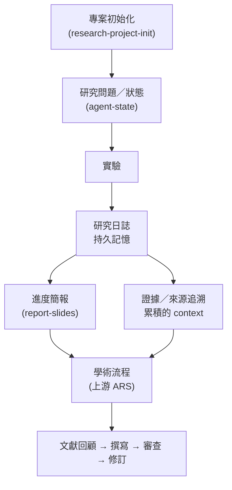

# research-lab-skills

[](https://github.com/zi-yue-1129/research-lab-skills/releases/tag/v1.1.0)
[](https://creativecommons.org/licenses/by-nc/4.0/)
[](https://github.com/zi-yue-1129/research-lab-skills)

[English](README.md) | [简体中文版](README.zh-CN.md) | [日本語版](README.ja-JP.md)

> **研究不該每開一次 AI 對話就歸零。**

---

## 這是什麼

每次開新的 AI 對話，它都不知道你上週試過什麼、什麼失敗了、為什麼改變方向、還有什麼沒解決。research-lab-skills 是狀態化的研究工作流基礎設施，把你的實驗、失敗、決策、證據跨工作階段連接起來，再把累積下來的歷程轉成進度／lab meeting 簡報、結構化的研究狀態，以及正式文獻／寫作／審查流程真的能接手的 context——而不是每次都從空白提示詞重新開始。

以 [Agent Skills](https://agentskills.io/specification) 格式建構。Claude Code 是目前已驗證的參考用戶端——詳見下方[平台狀態](#平台狀態)。

它結合兩個部分：本專案自行開發的研究基礎設施，以及一套上游的學術研究 pipeline——**Academic Research Skills（ARS），作者吳政宜（Cheng-I Wu）**（[`Imbad0202/academic-research-skills`](https://github.com/Imbad0202/academic-research-skills)，CC BY-NC 4.0）。詳見下方[上游歸屬](#上游歸屬)，以及逐路徑拆解的 [THIRD_PARTY_NOTICES.md](THIRD_PARTY_NOTICES.md)。

---

## 為什麼不一樣

### 持久的研究記憶

實驗不會消失在對話紀錄裡。每次跑的東西都有結構化記錄——Goal、Setup、Results、Failures、Analysis——用 `follows:` 明確連到前一篇記錄，用 `amended:` 記錄事後修正，還會連到由它生成的簡報。這是**專案層級的研究記憶**，不是對話記憶：它以檔案形式活在 `docs/research_log/` 裡，不是活在會被清空的 context window 裡。

### 狀態化的研究模型

日誌之上還有真正的狀態，不只是一堆 Markdown 檔案：`research-project-init` 把一個初步想法收斂成專案章程（問題陳述、範圍、限制、里程碑、成功／停止條件），並註冊進 `agent-state`——追蹤 Project、Research Question、去重過的 Source，以及帶著來源可追溯性的 Evidence 記錄。`resource-resolver` 讓每個技能都有一致的方式找到專案素材的位置。這些狀態不會在工作階段之間消失。

### 研究歷程 → 可編輯的進度簡報

這不是「貼論文、生簡報」那種工具。`/report-slides` 讀取數週的日誌歷程，自己判斷出什麼變了、什麼失敗了、目前的數字、做了什麼決策、接下來要做什麼——然後把它渲染成投影片：每張都有 SVG 原始檔、原生可編輯的 PPTX 物件（表格與圖表在 PowerPoint 裡還是可編輯的，不是被壓平的圖片），生成後還有視覺審查／驗證流程。

### 日常研究 → 學術銜接

要寫論文的時候，正式流程不是從空白提示詞開始——而是從已經記錄下來的研究狀態與歷程開始。這個銜接點，正是本專案原創工作的終點，以及上游 **Academic Research Skills** pipeline（深度研究、論文撰寫、同儕審查、全流程協調——作者吳政宜）接手的起點。

|  | 一般研究型 Agent | research-lab-skills |
|---|---|---|
| Context | 當前工作階段／上傳的檔案 | 持久的專案研究狀態 |
| 實驗 | 通常在外部、臨時記錄 | 一等公民、被完整追蹤的歷程 |
| 失敗的實驗 | 不會被保留 | 明確保留（`Failures`、`amended:`） |
| 決策 | 埋在對話紀錄裡 | 可追溯、可修訂 |
| 簡報 | 提示詞／文件 → 簡報 | 研究歷程 → 進度簡報 |
| 論文階段 | 從提示詞或檔案開始 | 接收累積的研究狀態 |
| 產出 | 一份最終報告或答案 | 持續累積的研究素材 |

---

## 各環節如何串接



重點是狀態的連續性，不是 agent 數量：前一階段累積的狀態，正是下一階段真正會讀取的東西——沒有任何一步是從空白提示詞開始的。

**第一階段 — 每日實驗期**（`/mode exp`）

```bash
/mode exp                        # 啟動實驗模式
/research-log add                # 記錄今天的實驗（quick 3 問引導、full 9 節完整）
/report-slides                   # 把本週日誌轉成 SVG + PPTX 進度簡報
/mode end                        # 結束時從 git diff 自動起草下次記錄
```

日誌的 `follows:` 欄位把實驗串成可追溯的時間線；`amended:` 記錄事後的修正；`slide_decks:` 在生成簡報後自動更新。每次實驗的*目標*、*結果*、*失敗*、*下一步*都有記錄，等到寫論文的時候，方法論章節和討論章節的素材就自然存在了。

**第二階段 — 文獻探索期**（`/mode explore`）

```bash
/mode explore
/ars-lit-review "你的主題"       # 文獻回顧，含 PRISMA 支援（上游 ARS）
/ars-socratic                    # 蘇格拉底對話，澄清研究問題
/mode end                        # 整理探索記錄，提取 RQ 與關鍵發現
```

**第三階段 — 論文撰寫與發表期**（`/mode publish`）

```bash
/mode publish
/ars-plan                        # 蘇格拉底引導規劃章節結構（上游 ARS）
/ars-full                        # 撰寫完整論文 + 引用驗證（上游 ARS）
/ars-review                      # 多視角同儕審查（上游 ARS）
/ars-re-review                   # 修訂後驗收（上游 ARS）
/ars-pipeline                    # 完整 pipeline（含誠信查驗，上游 ARS）
```

**日誌如何連接到論文**

| 日誌欄位 | 論文對應 |
|---------|---------|
| `Goal` + `Setup` | 方法論 |
| `Results` + `Charts` | 結果與圖表 |
| `Failures` + `Analysis` | 討論 / 限制 |
| `slide_decks:` 連結 | 圖表素材 |
| `follows:` 時間鏈 | 研究設計演進說明 |

→ 查看 **[examples/](examples/)** 完整範例：三篇涵蓋整個實驗週期的日誌、7 張 SVG 進度簡報（附可編輯 PPTX），展示從日常記錄到報告呈現的完整流程。

---

## 上游歸屬

**上游 ARS**（[`Imbad0202/academic-research-skills`](https://github.com/Imbad0202/academic-research-skills)，作者吳政宜（Cheng-I Wu），CC BY-NC 4.0）提供：

- 深度研究（`deep-research`）— 文獻搜尋、蘇格拉底式問題收斂、系統性回顧
- 學術論文撰寫（`academic-paper`）— 草擬、引用驗證、修訂輔導
- 同儕審查（`academic-paper-reviewer`）— 多視角審查模擬
- Pipeline 協調（`academic-pipeline`）— 把以上串接起來，含誠信查驗閘門

本專案自己的貢獻——在此獨立開發，不屬於上游專案：

- `research-log`、`report-slides`、`research-mode` — 每日研究日誌、進度簡報生成、工作階段模式路由
- `research-project-init`、`agent-state`、`resource-resolver` — 專案範疇界定，以及讓 Project、Question、Source、Evidence 跨工作階段保持連結的持久狀態層
- 讓兩套工具能一起安裝、並讓研究狀態能從日常層流向上游 pipeline 的整合封裝層

上游 ARS 的 agent pipeline 本身不是在本專案開發的。精確到路徑層級的拆解見 [THIRD_PARTY_NOTICES.md](THIRD_PARTY_NOTICES.md)，完整授權條款見 [NOTICE.md](NOTICE.md) / [LICENSE](LICENSE)。

---

## 安裝

### curl / PowerShell（推薦）

**macOS / Linux / Git Bash / WSL：**

```bash
# 全部技能（全域）
curl -fsSL https://raw.githubusercontent.com/zi-yue-1129/research-lab-skills/main/install.sh | bash

# 專案本機
curl -fsSL https://raw.githubusercontent.com/zi-yue-1129/research-lab-skills/main/install.sh | bash -s -- --local

# 只安裝 ARS 技能
curl -fsSL https://raw.githubusercontent.com/zi-yue-1129/research-lab-skills/main/install.sh | bash -s -- --ars-only

# 只安裝 Lab 技能
curl -fsSL https://raw.githubusercontent.com/zi-yue-1129/research-lab-skills/main/install.sh | bash -s -- --lab-only

# 解除安裝
curl -fsSL https://raw.githubusercontent.com/zi-yue-1129/research-lab-skills/main/install.sh | bash -s -- uninstall
```

**Windows（PowerShell）**——原生支援，不需要 Git Bash 或 WSL：

```powershell
# 全部技能（全域）
irm https://raw.githubusercontent.com/zi-yue-1129/research-lab-skills/main/install.ps1 | iex

# 帶旗標時需要取得腳本內容再執行，不能直接用管線傳給 iex，改用 scriptblock 包裝：
& ([scriptblock]::Create((irm https://raw.githubusercontent.com/zi-yue-1129/research-lab-skills/main/install.ps1))) -Local
& ([scriptblock]::Create((irm https://raw.githubusercontent.com/zi-yue-1129/research-lab-skills/main/install.ps1))) -ArsOnly
& ([scriptblock]::Create((irm https://raw.githubusercontent.com/zi-yue-1129/research-lab-skills/main/install.ps1))) -LabOnly
& ([scriptblock]::Create((irm https://raw.githubusercontent.com/zi-yue-1129/research-lab-skills/main/install.ps1))) -Uninstall
```

**Windows（cmd.exe）：**

```bat
powershell -Command "irm https://raw.githubusercontent.com/zi-yue-1129/research-lab-skills/main/install.ps1 | iex"
```

**如果防毒軟體 / EDR 擋掉上面這行：**有些資安軟體會直接攔截 `irm | iex`（下載後立即執行）這種指令樣式，不論實際內容是什麼——見下方的[git clone](#git-clone)方式，完全避開這個問題。

### git clone

在 macOS、Linux、Windows 上做法一致，也能避開部分防毒/EDR 軟體會攔截的 `curl | bash` / `irm | iex`（下載後立即執行）指令樣式：

```bash
git clone --depth 1 https://github.com/zi-yue-1129/research-lab-skills.git
cd research-lab-skills
```

**macOS / Linux / Git Bash / WSL：**

```bash
bash install.sh                # 全部技能（全域）
bash install.sh --local        # 專案本機
bash install.sh --ars-only     # 只安裝 ARS 技能
bash install.sh --lab-only     # 只安裝 Lab 技能
bash install.sh uninstall      # 解除安裝
```

**Windows（PowerShell）：**

```powershell
powershell -ExecutionPolicy Bypass -File install.ps1                # 全部技能（全域）
powershell -ExecutionPolicy Bypass -File install.ps1 -Local          # 專案本機
powershell -ExecutionPolicy Bypass -File install.ps1 -ArsOnly        # 只安裝 ARS 技能
powershell -ExecutionPolicy Bypass -File install.ps1 -LabOnly        # 只安裝 Lab 技能
powershell -ExecutionPolicy Bypass -File install.ps1 -Uninstall      # 解除安裝
```

安裝後重啟 Claude Code。詳細說明見 [docs/SETUP.zh-TW.md](docs/SETUP.zh-TW.md)。

> **附註：** 本專案先前曾提供 npm 套件（`crs` CLI）。目前未維護 npm 作為支援的安裝方式，請改用上方的 curl／PowerShell／git clone。CLI 原始碼仍保留在 repo 的 `bin/crs.js`，僅供參考。

---

## 技能總覽

| 技能 | 指令 | 功能 |
|------|------|------|
| `research-log` | `/research-log` | 結構化實驗日誌（新增、修訂、索引） |
| `report-slides` | `/report-slides` | 從日誌自動生成 SVG + PPTX 進度簡報 |
| `research-mode` | `/mode` | 工作模式路由（exp / daily / explore / report / publish） |
| `research-project-init` | `/research-init` | 把初步想法收斂成專案章程 + 可追蹤的研究問題 |
| `deep-research`*（上游 ARS）* | `/ars-full`, `/ars-lit-review`, … | 13 個 Agent 研究團隊，Socratic / PRISMA / fact-check |
| `academic-paper`*（上游 ARS）* | `/ars-plan`, `/ars-outline`, … | 12 個 Agent 論文撰寫，含引用驗證 |
| `academic-paper-reviewer`*（上游 ARS）* | `/ars-review`, `/ars-re-review` | 多視角同儕審查（主編 + 3 位審查者 + DA） |
| `academic-pipeline`*（上游 ARS）* | `/ars-pipeline` | 完整 10 階段 pipeline 協調器 |

---

## Lab 技能

### `/research-log` — 實驗日誌

**實驗日誌不是備忘錄，而是研究過程的記憶體。**

實驗往往有三種結局：成功、失敗、或「成功但不是預期中的方式」。這三種都值得記錄，而且通常只有第一種在論文裡出現。日誌讓剩下兩種也被保存下來，讓你未來能回答「為什麼沒試過 X」這個問題。

每篇日誌是一個 Markdown 檔案，帶有 YAML frontmatter：

```yaml
---
date: 2026-05-18
experiment: bert-finetuned-per-prompt
mode: full
tags: [BERT, fine-tuning, QWK, NLP]
follows: 2026-05-10_esa_baseline_quick
git_head: abc1234
slide_decks: []
amended:
  - date: 2026-05-20
    sections: [Results, Analysis]
    reason: 修正 P3 QWK 計算錯誤，更新後續分析
---
```

| 指令 | 說明 |
|------|------|
| `/research-log add` | 新增記錄（quick 3 問引導、full 9 節完整格式） |
| `/research-log amend` | 修訂現有記錄的某個章節 |
| `/research-log index` | 從 frontmatter 重建 `docs/research_log/INDEX.md` |
| `/research-log show [n]` | 顯示最近 n 筆記錄的摘要（預設 5） |
| `/research-log query` | 依章節與日期搜尋歷史，再於安全 token 預算內讀取選定結果 |

即使沒有啟用 `/mode`，Agent 也會在開始新實驗、診斷異常、調整參數或啟動成本高昂的重跑前，主動查閱相關歷史。

---

### `/report-slides` — 進度簡報生成器

讀取日誌記錄，提出投影片大綱讓你確認，再透過三種渲染路徑生成投影片：

- **[A] Python 腳本** — 資料驅動：長條圖、表格、指標卡、時間線
- **[B] Mermaid** — 流程圖、架構圖、狀態機
- **[C] Claude SVG** — 自由排版的概念圖、文字密集的內容

**輸出格式：**
- `slide01_title.svg`, `slide02_bar_chart.svg`, … — 可在向量編輯器中直接修改的 SVG 原始檔
- `deck.pptx` — **16:9 PPTX，原生 SVG 嵌入，可在 PowerPoint / Keynote 中編輯每一個元素**
- `slide_data.json` — Path A 的資料來源，用 `--slide N` 重新渲染單張

PPTX 的可編輯性是設計重點——標題、數字、顏色、佈局，在 PowerPoint 或 Keynote 裡都可以直接調整，不需要回來改原始碼。

**首次安裝依賴：**

```bash
pip install python-pptx
npm install -g @mermaid-js/mermaid-cli   # 選用，Mermaid 圖表
```

**投影片風格：** `default`、`minimal`、`dark`、`paper`

---

### `/mode` — 工作模式

宣告目前的研究模式，調整技能優先順序與工作階段的結尾行為：

| 模式 | 主要技能 | 適用時機 |
|------|---------|---------|
| `exp` | `research-log`（Full 模式）| 跑實驗，想在工作階段結尾自動記錄 |
| `daily` | 無（自由模式） | 輕量筆記、閱讀 |
| `explore` | `deep-research` | 文獻探索 |
| `report` | `report-slides` | 生成進度簡報 |
| `publish` | `academic-pipeline` | 撰寫與投稿論文 |

用 `/mode end` 結束工作階段，取得預填好的日誌草稿。

---

## 學術研究技能（ARS）*（上游）*

> **AI 是你的副駕駛，不是機長。** 這工具不會幫你寫論文。它處理苦工——搜文獻、排格式、驗數據、查邏輯一致性——讓你專注在真正需要你腦子的事：定義問題、選方法、詮釋數據的意義、寫出「我認為」後面那句話。

**👉 [docs/ARCHITECTURE.md](docs/ARCHITECTURE.md)** — 完整 pipeline 視圖：流程圖、階段矩陣、品質閘門

**👉 [docs/SETUP.zh-TW.md](docs/SETUP.zh-TW.md)** — API key、Pandoc/tectonic、跨模型驗證

**👉 [docs/PERFORMANCE.zh-TW.md](docs/PERFORMANCE.zh-TW.md)** — token 預算與費用（15k 字論文約 ~$4–6）

### 功能概覽

- **Deep Research**（`/ars-full`、`/ars-lit-review`、`/ars-systematic-review`）— 13 個 Agent 研究團隊。蘇格拉底引導、PRISMA 系統性回顧、四索引引用三角驗證（Semantic Scholar + OpenAlex + Crossref + arXiv）。
- **Academic Paper**（`/ars-plan`、`/ars-outline`、`/ars-abstract`）— 12 個 Agent 論文撰寫。風格校準、三層引用 anchor、LaTeX 強化、VLM 圖表驗證。
- **Academic Paper Reviewer**（`/ars-review`、`/ars-re-review`）— 7 個 Agent 多視角審查。主編 + 3 位動態審查者 + 魔鬼代言人，讓步門檻協議。
- **Academic Pipeline**（`/ars-pipeline`）— 10 階段端到端協調器。Stage 2.5 + 4.5 誠信閘門、素材護照、引用存在性查驗。

### 完整 pipeline

```
deep-research (socratic/full)
  → academic-paper (plan/full)
    → 誠信查驗 (Stage 2.5)
      → academic-paper-reviewer (full/guided)
        → academic-paper (revision)
          → academic-paper-reviewer (re-review, max 2 rounds)
            → 最終誠信查驗 (Stage 4.5)
              → academic-paper (format-convert → final output)
```

---

## 範例

[`examples/`](examples/) 目錄展示**日常實驗室歷程記錄**的完整樣貌，而不是事後整理的成果報告。

### 實驗日誌（研究過程記錄）

三篇涵蓋完整實驗週期的日誌——包括失敗、修正、與轉折：

| 日誌 | 模式 | 記錄了什麼 |
|------|------|-----------|
| [`2026-05-10_esa_baseline_quick.md`](examples/research-log/2026-05-10_esa_baseline_quick.md) | Quick | 第一天的基準測試，QWK=0.674，發現 zh-TW 遷移困難 |
| [`2026-05-18_bert_finetuned_full.md`](examples/research-log/2026-05-18_bert_finetuned_full.md) | Full | Fine-tuning 實驗，含**失敗的嘗試**與 P3 修正記錄（`amended:`） |
| [`2026-05-25_crosslingual_eval_full.md`](examples/research-log/2026-05-25_crosslingual_eval_full.md) | Full | 跨語言評估，DIF 公平性分析，兩筆修訂記錄 |

### 進度簡報（自動從日誌生成）

對應以上日誌的 7 張週報投影片，同時輸出 SVG 原始檔與可編輯 PPTX：

| 投影片 | 類型 | 說明 |
|--------|------|------|
| [`slide01_title.svg`](examples/report-slides/slide01_title.svg) | Title | 標題頁 |
| [`slide02_two_column.svg`](examples/report-slides/slide02_two_column.svg) | Two-column | 問題背景與研究方向 |
| [`slide03_timeline.svg`](examples/report-slides/slide03_timeline.svg) | Timeline | 三週實驗時間線（含 `amended` 標記） |
| [`slide04_bar_chart.svg`](examples/report-slides/slide04_bar_chart.svg) | Bar chart | EN vs. zh-TW QWK 跨模型比較 |
| [`slide05_table.svg`](examples/report-slides/slide05_table.svg) | Table | 模型效能對比（DIF 公平性標記） |
| [`slide06_metric_cards.svg`](examples/report-slides/slide06_metric_cards.svg) | Metric cards | 4 個關鍵指標 |
| [`slide07_conclusion.svg`](examples/report-slides/slide07_conclusion.svg) | Conclusion | 結論與後續步驟 |

資料來源：[`slide_data_weekly_progress.json`](examples/report-slides/slide_data_weekly_progress.json)

---

## 專案結構

```
docs/research_log/
  INDEX.md                              ← 自動生成（勿直接編輯）
  2026-05-25_crosslingual_eval_full.md

docs/slides/
  _style.md                             ← 專案預設風格（選用）
  reports/
    2026-05-25_weekly/
      slide01_title.svg
      deck.pptx                         ← 可在 PowerPoint/Keynote 直接編輯
      slide_data.json

scripts/
  generate_slides.py                    ← 首次使用時從 skill 複製
  to_pptx.py
```

---

## 平台狀態

- **Claude Code** — 已驗證的參考用戶端。上面提到的每個技能、指令、工作流程都是針對它開發與實際跑過的。
- **其他 Agent Skills 用戶端**（Codex、Cursor、Windsurf、Copilot 等）— 相容性尚未驗證。這些技能都是用標準的 [Agent Skills](https://agentskills.io/specification) `SKILL.md` 格式撰寫，設計上希望能跨用戶端移植，但在沒有實測證據之前，我們不會宣稱與任何其他用戶端行為對等。`docs/SETUP.zh-TW.md` 記錄了目前唯一確認的落差（Codex 的 imported-skills 機制無法重現 `/report-slides` 的圖表生成行為——見 [Issue #8](https://github.com/zi-yue-1129/research-lab-skills/issues/8)）。

---

## 授權與來源

本專案採用 [CC BY-NC 4.0](https://creativecommons.org/licenses/by-nc/4.0/) 授權。

- **Lab 技能與整合基礎設施**（`research-log`、`report-slides`、`research-mode`、`resource-resolver`、`agent-state`、`research-project-init`、封裝／安裝層）— [ZI-YUE,CHAO](https://github.com/zi-yue-1129) 原創（CC BY-NC 4.0）
- **學術研究技能**（`deep-research`、`academic-paper`、`academic-paper-reviewer`、`academic-pipeline`，及其對應的 `agents/`、`shared/`、`commands/`、`hooks/`）— 上游原作 [Cheng-I Wu（Imbad0202）](https://github.com/Imbad0202)（CC BY-NC 4.0）

詳見 [LICENSE](LICENSE)、[NOTICE.md](NOTICE.md)，以及逐路徑拆解的 [THIRD_PARTY_NOTICES.md](THIRD_PARTY_NOTICES.md)（含 `scripts/`、`examples/`、`docs/`、`evals/` 等混合目錄的精確歸屬）。

## 貢獻者

**ZI-YUE,CHAO** — Lab 技能與整合基礎設施作者、本專案維護者

**吳政宜 (Cheng-I Wu)** — 上游 ARS 原作者

**[aspi6246](https://github.com/aspi6246)**、**[mchesbro1](https://github.com/mchesbro1)**、**[cloudenochcsis](https://github.com/cloudenochcsis)**、**[eltociear](https://github.com/eltociear)**（日文翻譯）、**[xpfo-go](https://github.com/xpfo-go)**（簡中翻譯）— ARS 貢獻者
