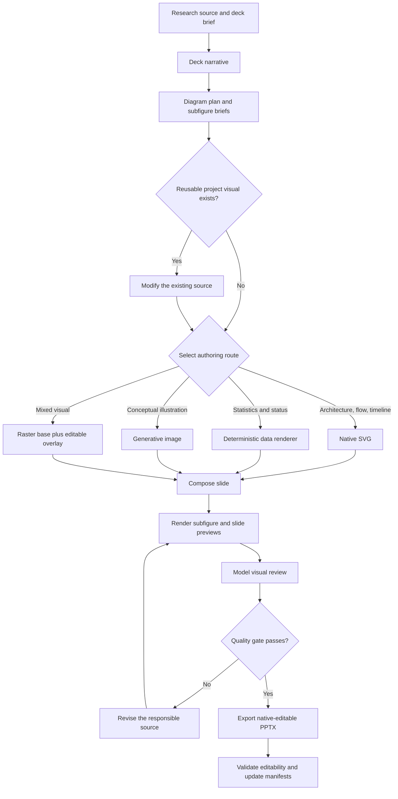

# Report Slides Visual Authoring and Reuse — Design Spec

**Date:** 2026-08-03
**Status:** Approved
**Approach:** Layered workflow with project-level visual assets and mandatory visual review
**Version:** 1.0

---

## Problem

`report-slides` can generate data-driven SVG slides, Mermaid diagrams, free-form
SVG, and editable PPTX output. It does not yet give an agent a reliable workflow
for planning complex subfigures, selecting an appropriate authoring method,
using generative image tools, reviewing rendered output with model vision, or
reusing an earlier visual when only part of it changes.

As a result, diagram-heavy decks can be structurally weak even when their text
is correct. Similar figures may be redrawn inconsistently, visual defects can
survive because only source files were inspected, and the final PPTX can mix
editable and raster content without disclosing the difference.

## Goals

1. Plan every non-trivial visual as one or more purpose-driven subfigures.
2. Support architecture diagrams, flowcharts, conceptual illustrations,
   timelines, statistical charts, status views, and hybrid visuals.
3. Use generative image tools for suitable illustrative content while keeping
   factual text, numeric data, labels, arrows, and callouts editable.
4. Require the agent to inspect rendered subfigures and complete slides with its
   own visual capability and revise defects before delivery.
5. Preserve editable PowerPoint objects wherever the visual form permits.
6. Reuse project-level visual assets when their semantics remain the same and
   record the exact regions changed.
7. Report the editability level, reused source, modifications, and review result
   for every delivered visual.

## Non-goals

- Do not make raster pixels individually editable in PowerPoint.
- Do not use generative image models to draw statistical data or authoritative
  technical labels.
- Do not create a cross-project or user-global visual asset library.
- Do not replace the existing SVG-to-native-PPTX converter.
- Do not require one renderer or one visual style for every diagram type.
- Do not add presentation animations.
- Do not retain temporary review annotations in final slides.

## Design Overview

Keep `SKILL.md` as the mandatory orchestration layer and move detailed visual
authoring guidance into focused references. Each deck begins with a diagram
plan. Each reusable visual has a stable project-level asset directory and a
manifest that records semantics, sources, editability, provenance, review
state, and changes from an earlier asset.

The agent routes each visual to native SVG, a deterministic data renderer, a
generative image tool, or a hybrid composition. It renders both individual
visuals and complete slides, reviews the pixels with model vision, revises the
source, and repeats until the quality gate passes. PPTX export remains the last
stage and uses the existing native SVG-to-PPTX path by default.



## 1. Skill Structure

The implementation extends the current skill without replacing its renderers:

```text
skills/report-slides/
├── SKILL.md
├── references/
│   ├── diagram-workflow.md
│   ├── diagram-patterns.md
│   ├── generative-visuals.md
│   ├── visual-review.md
│   └── styles/
└── scripts/
    ├── generate_slides.py
    ├── validate_diagram_manifest.py
    ├── render_review_sheet.py
    └── svg_to_pptx/
```

`SKILL.md` contains only the required workflow, route selection, stop
conditions, and links to detailed references. The references divide judgment
by concern so an agent loads only what the current visual requires.

`validate_diagram_manifest.py` performs deterministic structural validation.
It does not attempt to replace visual judgment. `render_review_sheet.py`
assembles rendered assets into a convenient inspection surface when the local
environment supplies the required renderer. Both scripts use typed public
functions, Google-style docstrings, explicit errors, and no silent fallbacks.

## 2. Project-Level Asset Model

Visual assets live within the project that owns their semantics and style:

```text
docs/slides/
├── assets/
│   └── diagrams/
│       └── <diagram_id>/
│           ├── manifest.yaml
│           ├── source.svg
│           ├── prompt.md
│           ├── data.json
│           ├── generated.png
│           └── review.json
└── reports/
    └── <deck_name>/
        ├── diagram-plan.yaml
        ├── slide01.svg
        ├── slide01-review.png
        └── deck.pptx
```

Only files required by a visual are created:

- Native diagrams normally store `source.svg`.
- Statistical visuals store `data.json` and a reproducible render source.
- Generative visuals store `prompt.md`, declared reference inputs, and the
  generated raster artifact.
- Hybrid visuals store the raster base separately from the editable SVG
  annotation layer.
- `review.json` stores structured findings for the latest passing render.
- Git provides file history; the asset directory does not duplicate every
  revision.

### 2.1 Stable identity

`diagram_id` identifies a semantic visual, not a slide number or output file.
Moving a visual to another slide does not change its identity. A materially new
message or model becomes a new visual with `derived_from`; a layout or content
revision to the same message retains the existing ID.

### 2.2 Manifest contract

Every reusable visual manifest records at least:

```yaml
schema_version: 1
diagram_id: training-pipeline
purpose: Explain the training, evaluation, and publishing stages.
diagram_type: architecture
editability: native
source_files:
  - source.svg
used_in:
  - deck: weekly-progress
    slide: 4
derived_from: null
based_on_revision: null
changes: []
review:
  status: passed
  artifact: review.json
```

`editability` is one of:

- `native`: principal elements become individual PowerPoint objects;
- `hybrid`: raster artwork is combined with editable information layers;
- `raster`: the visual remains a replaceable and crop-able picture, but its
  internal pixels are not individual objects.

Missing required fields, missing source files, unknown editability values, or a
reported passing review without its artifact are hard validation errors.

## 3. Diagram Planning Contract

Before drawing a non-trivial visual, the agent creates a subfigure brief that
answers:

1. What should the audience understand after viewing it?
2. Which subfigures or named regions are required?
3. What is the intended reading order?
4. Which elements represent facts, measured data, or precise structure?
5. Which elements may be interpreted freely by a generative image model?
6. Which elements must remain individually editable in PowerPoint?
7. Does the project asset library already contain the same semantic visual?

The deck-level `diagram-plan.yaml` maps these briefs to slides and records the
chosen renderer before generation. Complex visuals are decomposed into named
regions such as input, processing, model, output, and cross-cutting monitoring.
The agent must not start from decorative details before defining this semantic
structure.

## 4. Authoring Routes

| Visual type | Default route | Required editable elements | Contract |
|---|---|---|---|
| Architecture | Native SVG | Nodes, labels, groups, connectors | Show boundaries, direction, hierarchy, and interfaces. |
| Flowchart | Native SVG | Steps, decisions, branch labels, connectors | Label every branch and avoid unnecessary crossings. |
| Timeline | Data-driven SVG | Dates, events, intervals, milestones | Disclose when spacing is not proportional to time. |
| Statistical chart | Deterministic renderer | Axes, legend, labels, series | Preserve source data; never delegate values to image generation. |
| Conceptual illustration | Generative image or SVG | At least the annotation layer | Keep precise text and numeric claims outside the raster artwork. |
| Hybrid visual | Raster base plus SVG overlay | Text, arrows, boxes, legend | Separate illustrative and informational layers. |
| Status or matrix view | Data-driven SVG | Cards, states, labels, legend | Encode meaning with text or shape as well as color. |

### 4.1 Generative image rules

Use a generative image tool only when illustration adds explanatory value that
native shapes cannot efficiently provide. The prompt describes composition,
subject, palette, lighting, empty annotation regions, exclusions, and target
aspect ratio. It asks for no embedded prose, labels, legends, or precise
numbers. Those elements are added afterward as editable SVG objects.

When an existing image or visual is being revised, provide that artifact as the
edit reference and identify the requested region-level changes. Do not generate
a visually unrelated replacement merely because editing is possible.

If no generative image capability is available, report the missing capability.
Do not substitute a blank placeholder, unlicensed web image, or lower-quality
output while presenting it as equivalent.

## 5. Reuse and Change Disclosure

Before creating a new visual, search project manifests by purpose, type, and
semantic components. Choose one of three outcomes:

- `reuse`: use the existing source unchanged;
- `modify`: retain the same `diagram_id`, record the prior Git revision in
  `based_on_revision`, and edit named regions;
- `derive`: create a new `diagram_id` with `derived_from` when the visual's core
  message or system model changes.

Every modification records a named region and, when applicable, a bounding box
in the `1200 × 675` slide coordinate system:

```yaml
based_on_revision: git:4b29f2a
changes:
  - region: evaluation-stage
    bbox: [760, 180, 1080, 420]
    change: Added the human-review branch and failure return path.
    reason: Publishing now requires explicit manual approval.
```

The delivery summary highlights reused assets and changed regions. A temporary
diff preview may outline changed regions for review, but those annotations are
removed from the final slide.

## 6. Mandatory Visual Review Loop

The agent inspects rendered pixels rather than relying on SVG markup, source
code, or manifest fields. Review occurs at two levels:

### 6.1 Subfigure review

- semantic correctness and completeness;
- reading order and visual hierarchy;
- connector direction, attachment, and crossings;
- label placement, legends, scale, and proportions;
- visual focus and unnecessary decoration;
- generative-image artifacts, fake text, and misleading structures.

### 6.2 Slide review

- density and balance;
- alignment, spacing, and margins;
- typography and projected-screen readability;
- contrast and non-color semantic cues;
- consistency with the deck style and related visuals;
- clipping, overlap, overflow, and unintended empty regions.

If a finding fails the gate, the agent identifies the responsible source,
revises it, re-renders, and re-inspects both levels. It continues until the gate
passes. If missing data, unavailable tools, or an environment failure prevents
further revision, the agent stops with an explicit blocker and does not call the
deck complete.

The following conditions always fail the gate:

- clipped, overlapping, truncated, or unreadably small text;
- arrows with incorrect direction or connectors crossing unrelated nodes;
- chart marks that disagree with their source data;
- color as the only carrier of meaning;
- fake text or misleading scientific structure in generated imagery;
- inconsistent styling among equivalent visual elements;
- a modified reused visual without region-level change disclosure;
- undisclosed rasterization of information expected to be editable.

## 7. PPTX Export and Editability Validation

After the visual review passes, export with the existing native
`svg_to_pptx` path. Validate the presentation package structurally and, when a
PowerPoint-compatible renderer is available, render the exported deck and
compare its visible result with the approved slide preview.

The completion summary distinguishes:

- SVG or slide-preview visual review;
- native PPTX structural validation;
- post-export rendered-deck validation;
- any environment limitation that prevented one of these checks.

Do not flatten these signals into a single generic “passed” result.

## 8. Completion Report

For each visual, report:

- `diagram_id`, diagram type, and slide location;
- selected authoring route and editability level;
- whether it was created, reused, modified, or derived;
- reused source and each changed region with its reason;
- visual-review status and number of revision rounds;
- PPTX editability validation status;
- any remaining raster elements and why they remain raster.

## 9. Error Handling

- Missing factual data: stop that visual and request or report the missing
  input; do not invent chart values or system components.
- Invalid manifest: fail validation with exact file and field information.
- Unavailable optional renderer: choose another route only when it preserves the
  agreed semantics, quality, and editability; otherwise report a blocker.
- Generative image safety or capability failure: keep the issue explicit and do
  not silently replace the requested artifact.
- Visual-review failure: retain the failing render for diagnosis, revise the
  source, and do not export it as the final deck.
- PPTX conversion loss: identify the affected objects and either correct the
  SVG/converter path or disclose a user-approved hybrid/raster result.

## 10. Validation Strategy

Skill changes follow RED–GREEN–REFACTOR with the same realistic scenarios
before and after the update:

1. **Architecture scenario:** decompose a multi-stage system and produce native
   editable nodes, labels, and connectors.
2. **Hybrid illustration scenario:** generate an illustrative raster base and
   place factual annotations in an editable overlay.
3. **Statistical scenario:** reconstruct a chart from source data and verify the
   rendered marks against that data.
4. **Revision scenario:** find a project asset, edit only the requested region,
   and produce a precise change disclosure.
5. **Visual-defect scenario:** catch and repair overflow, overlap, weak contrast,
   bad routing, or inconsistent styling from rendered previews.

Baseline runs use the current skill and record omissions and rationalizations.
Updated runs receive the revised skill and must satisfy the structural output
contract and actual visual-review loop. Deterministic tests cover manifest
validation and review-sheet generation. Existing SVG-to-PPTX tests remain a
regression gate, and at least one complete example deck exercises planning,
reuse, review, export, and editability reporting.

## 11. Acceptance Criteria

The feature is complete when:

1. `SKILL.md` makes diagram planning, reuse search, rendered visual review,
   revision, PPTX validation, and change disclosure mandatory.
2. Detailed references cover all authoring routes and visual review without
   making the main skill unreasonably large.
3. Project manifests validate deterministically and identify source files,
   editability, use sites, derivation, changes, and review state.
4. A generated-image route produces editable factual overlays and discloses its
   raster layer.
5. Statistical charts remain deterministic and traceable to source data.
6. A reused visual is modified from its earlier source and reports named change
   regions.
7. Agents inspect rendered subfigures and complete slides and repair failed
   gates before claiming completion.
8. Native PPTX export preserves editable elements supported by the existing
   converter and reports validation stages separately.
9. Skill validation, new deterministic tests, existing SVG-to-PPTX tests, and a
   complete example workflow pass.
