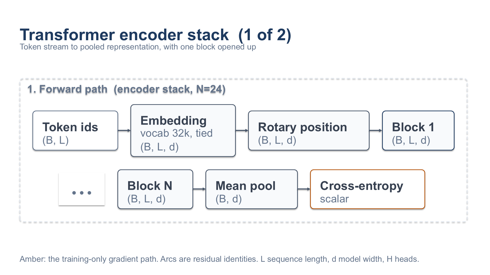

# examples/architecture-diagram — 架構圖範例

這個目錄展示 `report-slides` 技能的 `diagram_builder`：用**資料**描述一張技術架構圖，尺寸與座標由工具從實際文字量測推導，再由兩道閘門驗證。



## 自己跑一次

```bash
python3 examples/architecture-diagram/build_diagram.py
```

只需要 Python 與 `PyYAML`。腳本會自己找到技能目錄（先看 `~/.claude/skills/`，再看這個 repo），輸出 `slide-01.svg`。SVG 在任何向量編輯器裡都能開，GitHub 也會直接渲染。

改圖就是改 `build_diagram.py` 裡的組合，然後重跑。

## 你不會寫到任何一個座標

```python
attn = d.group(detail, "attn", "Self-attention", flow="row")
ln1  = d.node(attn, "ln1", ["LayerNorm"], shape="(B,L,d)")
sdp  = d.node(attn, "sdp", ["Attention", "H heads"], shape="(B,H,L,L)", kind="accent")
add1 = d.op(attn, "add1", "+")
d.connect(ln1, add1, route="over")     # 殘差 identity，繞過它跨越的區塊
```

- **框的寬度由標籤的實測寬度決定**，所以框不可能容不下標籤
- 位置對齊 token 的格線，顏色只能來自 `color.roles`
- 連接線綁在節點的**連接埠**上，所以懸空的線畫不出來
- 放不下時工具會**報錯並說出超出幾個單位**，而不是默默畫出畫布

## 這張圖示範了什麼

| 元素 | 對應的 API |
|---|---|
| 上下兩個帶 | `d.section(..., band=0 / band=1)` |
| 巢狀群組（Self-attention / Feed-forward） | `d.group(section, ...)` |
| 運算子圓 ⊕ | `d.op(group, "add1", "+")` |
| 重複區塊省略號 | `d.ellipsis(section)` |
| 殘差 identity 弧線 | `d.connect(..., route="over")` |
| 跨帶的訓練梯度路徑（琥珀色虛線） | `d.connect(..., kind="aux", style="dashed")` |
| 每格的張量形狀 | `shape="(B,H,L,L)"` |
| 語意化節點類型 | `kind="data" / "module" / "accent" / "aux"` |

## 驗證

圖產生後可以用技能自己的兩道閘門檢查：

```bash
SCRIPTS=skills/report-slides/scripts

# 1. 樣式 linter：16 項可量測檢查（格線、間距、對比、連接線、佔用率…）
python3 $SCRIPTS/validate_visual_style.py \
    --svg examples/architecture-diagram/slide-01.svg \
    --tokens skills/report-slides/references/tokens/default.tokens.yaml
```

第二道閘門量的是**實際匯出的 PPTX**，不是背後的 SVG——因為 `python-pptx` 沒有字型度量，無法知道一段文字排版後會多寬。它需要 Windows 上的 PowerPoint：

```bash
python3 $SCRIPTS/validate_pptx_layout.py --pptx architecture.pptx
```

沒有 PowerPoint 時它會回報 `blocked` 並說明缺少什麼，而不是假裝通過。

## 轉成可編輯的 PPTX

```bash
cd skills/report-slides/scripts
python3 -c "from svg_to_pptx.converter import convert_file; \
    convert_file('examples/architecture-diagram', 'architecture.pptx')"
```

每個節點會變成一個原生圓角矩形、標籤內嵌——在 PowerPoint 裡雙擊即可改字，拖曳時標籤跟著走。

## 密度的上限

這張圖用的是預設 token 集，它為**投影片**校準：`node_label` 18、`caption` 16，都已經在 schema 的下限；畫布固定在 1200×675。論文裡那種整頁、更密的架構圖需要更小的字級或更大的畫布，兩者目前都被 schema 擋住（`design-tokens.schema.json` 的 `typeRole18` 與 `canvas.width: const 1200`）。

換句話說，密度的天花板是這個技能刻意的設計選擇，不是 `diagram_builder` 的限制。要突破就得改 schema，那是另一個決定。
