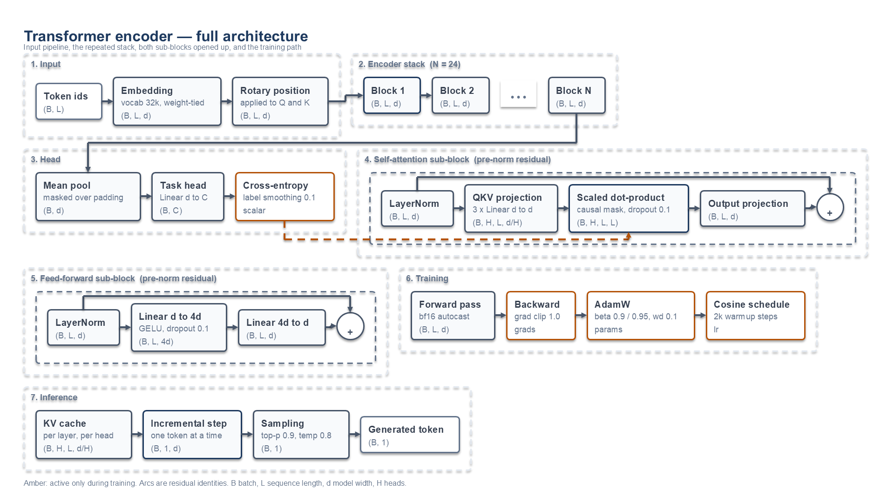
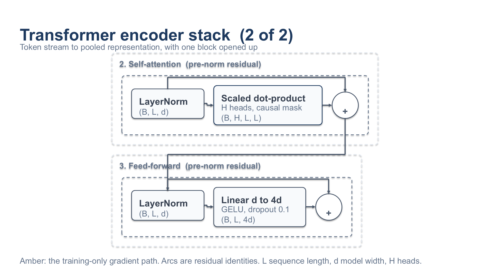

# examples/architecture-diagram — 架構圖範例

這個目錄展示 `report-slides` 技能的 `diagram_builder`：用**資料**描述一張技術架構圖，尺寸與座標由工具從實際文字量測推導，再由兩道閘門驗證。

**高密度版本**（`figure` token 集，2400×1350，一頁 25 個節點）：



**投影片版本**（`default` token 集，1200×675，自動分成兩張）：




## 自己跑一次

```bash
python3 examples/architecture-diagram/build_figure.py    # 高密度單頁圖
python3 examples/architecture-diagram/build_diagram.py   # 投影片版，自動分頁
```

只需要 Python 與 `PyYAML`。腳本會自己找到技能目錄（先看 `~/.claude/skills/`，再看這個 repo），輸出 `slide-01.svg`。SVG 在任何向量編輯器裡都能開，GitHub 也會直接渲染。

改圖就是改 `build_diagram.py` 裡的組合，然後重跑。

## 你不會寫到任何一個座標

```python
attn = d.group(detail, "attn", "Self-attention", flow="row")
ln1  = d.node(attn, "ln1", ["LayerNorm"], shape="(B,L,d)")
sdp  = d.node(attn, "sdp", ["Attention", "H heads"], shape="(B,H,L,L)", kind="accent")
add1 = d.op(attn, "add1", "+")
d.connect(ln1, add1, route="over")     # 殘差 identity，繞過它跨越的區塊
```

- **框的寬度由標籤的實測寬度決定**，所以框不可能容不下標籤
- 位置對齊 token 的格線，顏色只能來自 `color.roles`
- 連接線綁在節點的**連接埠**上，所以懸空的線畫不出來
- **放不下時工具會自己解決**：一列太長就自動換行、一個帶塞滿就自動開下一個帶、一張投影片放不下就**自動排到下一張**

## 這張圖示範了什麼

| 元素 | 對應的 API |
|---|---|
| 上下兩個帶 | `d.section(..., band=0 / band=1)` |
| 巢狀群組（Self-attention / Feed-forward） | `d.group(section, ...)` |
| 運算子圓 ⊕ | `d.op(group, "add1", "+")` |
| 重複區塊省略號 | `d.ellipsis(section)` |
| 殘差 identity 弧線 | `d.connect(..., route="over")` |
| 跨帶的訓練梯度路徑（琥珀色虛線） | `d.connect(..., kind="aux", style="dashed")` |
| 每格的張量形狀 | `shape="(B,H,L,L)"` |
| 語意化節點類型 | `kind="data" / "module" / "accent" / "aux"` |

## 驗證

圖產生後可以用技能自己的兩道閘門檢查：

```bash
SCRIPTS=skills/report-slides/scripts

# 1. 樣式 linter：16 項可量測檢查（格線、間距、對比、連接線、佔用率…）
python3 $SCRIPTS/validate_visual_style.py \
    --svg examples/architecture-diagram/slide-01.svg \
    --tokens skills/report-slides/references/tokens/default.tokens.yaml
```

第二道閘門量的是**實際匯出的 PPTX**，不是背後的 SVG——因為 `python-pptx` 沒有字型度量，無法知道一段文字排版後會多寬。它需要 Windows 上的 PowerPoint：

```bash
python3 $SCRIPTS/validate_pptx_layout.py --pptx architecture.pptx
```

沒有 PowerPoint 時它會回報 `blocked` 並說明缺少什麼，而不是假裝通過。

## 轉成可編輯的 PPTX

```bash
cd skills/report-slides/scripts
python3 -c "from svg_to_pptx.converter import convert_file; \
    convert_file('examples/architecture-diagram', 'architecture.pptx')"
```

每個節點會變成一個原生圓角矩形、標籤內嵌——在 PowerPoint 裡雙擊即可改字，拖曳時標籤跟著走。

## 你自己的架構，多複雜都可以描述

這是重點：**你不需要先把版面算好**。描述你的模型，工具負責排。

上面這張示範圖第一次寫出來時，一張投影片放不下——工具沒有把問題丟回來，而是自動排成兩張，並回報那條跨頁無法繪製的連線：

```
wrote examples/architecture-diagram/slide-01.svg
wrote examples/architecture-diagram/slide-02.svg
note: stack-loss -> attn-g-sdp spans a page break and was not drawn
```

只有當**單一區段本身就超過一整張畫布**時它才會停下來，而且會說清楚該怎麼辦：

```
ValueError: section 'blk' is 49 units taller than a whole canvas on its own;
shorten its labels or split it into two sections
```

那次的處理方式就寫在 `build_diagram.py` 裡：照它說的把一個區段拆成兩個，分頁隨即自然解決。

## 高密度圖怎麼來的

兩個腳本描述的是**同一個東西**，差別只有一行：

```python
TOKENS = yaml.safe_load((SKILL / "references/tokens/figure.tokens.yaml").read_text())
```

`figure.tokens.yaml` 與 `default.tokens.yaml` **除了畫布以外完全相同** —— 一樣的字級、一樣的間距下限、一樣的色票。畫布從 1200×675 變成 2400×1350（仍是 16:9，所以放進簡報不會變形）。

密度就是從這裡來的，而且**沒有降低任何易讀性下限**：

| | 投影片 | 圖表 |
|---|---|---|
| 畫布 | 1200×675 | 2400×1350（四倍面積） |
| `node_label` 宣告值 | 18 | 18（相同） |
| 實際渲染 | 18pt | **9pt** |
| 相對大小 | — | 一半 |

`svg_to_pptx` 現在會用 1200 單位作為基準來縮放宣告的字級。1200 畫布的比例是 1.0，所以**既有的簡報一個位元組都沒變**（207 個轉換器測試全過）。

## Schema 怎麼放行的

`design-tokens.schema.json` 原本把畫布寫死成 `const: 1200`。現在加了 `kind` 欄位，並用條件式規則：

- 沒有 `kind` 或 `kind: slide` → 畫布仍然**只能是** 1200×675
- `kind: figure` → 可用 1200 / 1600 / 2000 / 2400，且**必須維持 16:9**

型別下限與間距下限**一律沒有放寬**。四道守衛都有測試釘住：投影片不能用大畫布、圖表不能用非 16:9、圖表不能低於字級下限。

## 該選哪個畫布

`figure.tokens.yaml` 用的是 2400×1350。內容較少時 1600×900 或 2000×1125 也合法，改 token 檔的 `canvas` 即可——選一個剛好裝得下的，留白太多的圖不會比較好讀。
